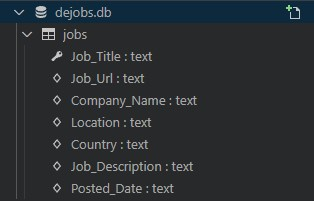

# DeWork Web Parser Script


## Content
1. [Introduction](#intro)
2. [Structure description](#structdesc)
3. [How the script works](#howworks)
4. [Database SQL Tables](#DB)
5. [How deploy script on the server](#deploy)


---

## <a id='intro'>Introduction</a>
The purpose of this script is to parse data from dejobs.org, then process them and save them to the database and json file.
___
## <a id='structdesc'>Structure description</a>

File ```dejobs.py``` сontains actually script for parsing data from [dejobs.org](https://dejobs.org/jobs/) and saves it to database and json file.


##### When creating the script, the following modules were used:
```
requests==2.24.0
beautifulsoup4==4.9.3
datetime
argparse
sqlite3
re
json
```
and dependencies that come with them.
___

## <a id='howworks'>How the script works</a>
We make a request to the web using the requests module, and then, after receiving the html file, we go thrue file and then find and parse the data we need.

First we parse the links to the job offers from the main page, which has pagination, to go through the other pages of main page. We identify the offset and then increase it by 15, to go through the pages. /we do it with the help of ```jobs_urls_getter``` function.

Next, when we have collected all the links to the job offer from all the pages we want, we start making requests in the ```page_parser``` function to each link for each job offer, get the html document of each page of job offer and then parse the data we need.
___


## <a id='DB'>Database SQL Tables</a>
### Jobs Table Schema


**In the screenshot you can see what attributes our table has.**
I would like to focus attention on the attribute **Job_Title**, which is Primary Key, to avoid duplicates in DB.
___

## <a id='deploy'>How deploy script on the server</a>
First, we need to create a virtual environment in which we install the version of python we need and all the modules that our script requires.

Then, in program we can write something like this for connect to real DB:
```python
DB_HOST, DB_NAME, DB_USER, DB_PASSWORD = tuple(
        os.environ.get(x) for x in ['DB_HOST', 'DB_NAME', 'DB_USER', 'DB_PASSWORD'])
```
to load all these variables from .env.
All these variables are stored in .env becouse of security reasons.

To run the script on the server at 11:55pm each day, we need to run crontab service ```crontab -e```, then in editor we need set the time when our script will be executed.
We can do it this way -
```
55 23 * * * /bin/bash -c "cd /home/OUR_USER/script_folder/ && source .venv/bin/activate && python /home/OUR_USER/script_folder/dejobs_parser.py --pages_to_parse (number of pages)"
```
This command, added to the tab cron, will automatically start a virtual environment and in it run our script on the server at the time we want every day.


